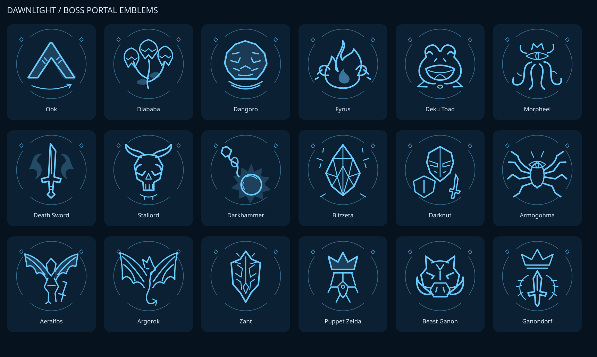

# Boss portal symbols

Each of the 18 boss and miniboss destinations in the Boss Rush hub is a complete
Mirror of Twilight from the Mirror Chamber. It replaces that boss's floor portal.
An original abstract emblem sits on the mirror face: blue means undefeated, red
means defeated, using the existing persistent save flags. The center Boss Rush
and Cave of Ordeals floor portals remain available.



## Artwork and provenance

`art/boss-portal-symbols.svg` is the editable source, newly drawn for Dawnlight.
Curved paths, rounded strokes and a shared broken-ring frame give the symbols a
consistent appearance. The motifs refer to weapons, elements or broad creature
shapes; they contain no extracted game textures, model renders or traced game
art. The artwork, generator and renderer were written for this change. No code
or assets were taken from Twilit Essentials or PR #23.

The SVG's 18 symbols follow `kBossRushEntries` in `src/new_save_modes.cpp`:
boomerang, plant, rock, flame/chains, toad, tentacles, spectral sword, skull,
flail, ice crystal, armor, spider, winged sword, dragon, mask, marionette,
boar and crowned sword. The generator checks the names and ordering.

## Regenerate

Normal builds use the checked-in generated header and require no graphics tools.
To edit the artwork and regenerate the embedded mask:

```sh
python -m pip install CairoSVG==2.9.1 Pillow==12.3.0
python tools/generate_boss_symbols.py --preview /tmp/boss-symbols.png
```

The generator rasterizes each vector at 1024×1024 and downsamples to 256×256
with Lanczos filtering. The atlas contains only alpha, so both state colors use
the exact same shape. A bounded RLE decoder reads the embedded atlas. Base64
strings are split into small chunks for MSVC compatibility. The runtime creates
five mip levels and uses linear filtering for smooth edges at different distances.
Only this original artwork is added to the packaged mod.

## Mirrors and rendering

A dedicated `DLBMir` ActorService profile loads the complete `u_mr_mirror` disc
and its `u_mr_table` frame/stand from the player's `MR-Table` archive at runtime.
No Nintendo model or texture is included in the mod. Both models use native
scale `(1, 1, 1)`. The stand is sampled at the final frame of `u_mr_table_up`,
matching its raised Mirror Chamber pose. The mirror attaches to the stand's
`MIRROR` joint with its own root transform preserved, as in the original game.
The actor uses shared archive references and per-actor model heaps, without
running chamber switches, stairs, effects, cutscenes or reflection singleton logic.

The former fixed 440-unit diameter and 240-unit center height are removed.
The entire posed assembly is placed with only yaw and translation, facing the
hub center. The frame model also contains the chamber's stone platform, so its
lowest vertex is not a suitable floor anchor. Placement instead uses the native
standing-panel height (Y = 4613.6299, documented in the SDK mirror-table actor)
and buries that surface 2 units below the hub floor. The platform underneath it
stays underground; the frame, attached mirror and fitted symbol move together.
Neither the disc nor the stand is resized to fit the artwork. Instead, the symbol
size follows the loaded vanilla disc dimensions, inset to leave the rim visible.
The animation remains frozen in the raised pose and its shared joint calculator
is restored after each evaluation/draw.

A dark circular face and slightly strengthened strokes improve contrast. The
image stays fixed to the inward-facing front; looking from behind hides the
symbol instead of moving it onto the back. The native attachment, tilt and
relative position between the mirror and its frame are preserved. The symbol plane is fitted
to the loaded mesh's broad front surface using its vertex positions and authored
normals, rather than the axis-aligned bounding box. Geometric plane candidates
from inner vertices also handle smoothed bevel normals. Raised rim vertices are
downweighted and rear planes are excluded. All four symbol corners use this same
plane with a fixed 0.4-unit normal offset to avoid z-fighting. No camera-dependent
rotation, flipping or front/back relocation is applied.

The existing GfxService renderer draws the emblem faces with scene depth testing
and depth writes. Transparent corners are discarded; later translucent effects
cannot paint through the solid mirror face. Pipelines match MSAA, reversed depth
and deferred render layouts. It never edits the model's materials or GX state.
GPU resources initialize lazily and are released on shutdown. ActorService drains
the mirror actors before removing their profile.

Hub spawning retains live and asynchronously loading IDs, retries missing slots
individually and attempts at most one destination per tick. Midna's existing
Fight / Yes / No prompt only becomes available once its mirror is ready. Hub
supplies, boss entry logic, saved progress and both center portals retain their
existing behavior.

## Validation

- Local Linux release-with-debug-info build and `.dusk` packaging passed.
- C++ atlas decoding was compared byte for byte with the SVG generator output.
- All 18 artwork names and portal indices match.
- The pinned Dawn library's validation backend accepted the actual shader,
  texture upload, mip chain, bindings and 12 pipeline combinations: forward and
  reversed depth, 1×/4× MSAA, and one/two/three color attachments.

- Geometry tests cover all 18 facing directions with each possible local disc
  axis, native attachment offsets, unchanged scale/distances, buried platform
  tops and foundations with the native mirror height preserved,
  artwork sizing from the original dimensions and invalid bounds. Additional tilted-disc tests cover
  all 18 directions, the authored front, raised rims, plane alignment at all
  four corners and fixed inward-facing visibility.
- An extracted spawn-function harness covers delayed loads, single-slot retries,
  missing actors and keeping exactly 18 mirrors plus two center floor portals.

Run the geometry test with:

```sh
c++ -std=c++20 tests/boss_mirror_geometry_test.cpp -o /tmp/mirror-test
/tmp/mirror-test
```

The validation backend does not load game archives or render a game scene.
In-game verification is still needed for the vanilla stand/disc fit and ground
placement, distance visibility, first hub entry, Midna prompts, saved colors and returns.
